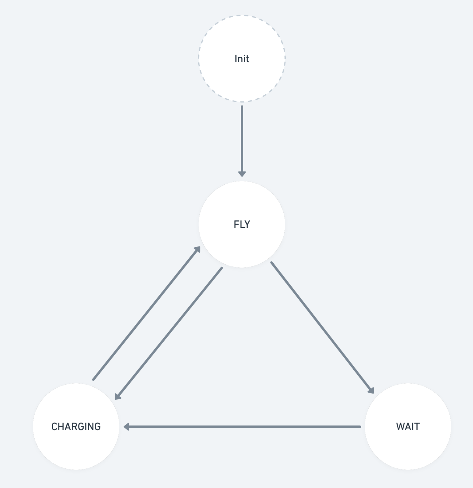

# eVTOL_Simulation

## Introduce

A small simulation program. Given the parameters of planes produced by 5 companies, e.g., cruise speed, battery capacity, time to charge, energy use at cruise and probability of fault per hour. 20 planes from this 5 company take off at the same time. After the power is exhausted, these aircraft will successively go to the charging station to recharge. The charging station has 3 chargers, and these aircraft will take off after they are fully charged. Assume that the flight speed is always constant. Use three minutes in simulation program to simulate three hours in practice.

## How to run

- BUILD 

`make`

- RUN 

Single thread: `./sc`

Multi Thread:  `./mc`

## plane's state

Every frame: plane-class

- FLY: When the power is used up, if the charging pile is free, it will enter the charging state, if there is no free charging pile, it will enter the waiting queue
- CHARGING: When the battery is fully charged, it enters the flying state

Every frame: ChargingStation-class

- If there is an idle charging pile, the queued aircraft will be ejected from the queue to the charging pile for charging.

## achieve
Solution1: Single Thread

Solution2: Multi Thread

- Use mutex lock the waiting queue
- Use semaphore tell plane the frame +1

## unit test
Calculate whether the number of flying frames + the number of waiting frames + the number of charging frames is equal to the total number of frames.

## Makefile

The .o file will be placed under the obj folder, and the executable file will be placed under the bin folder. If the corresponding folder does not exist, a new folder will be created.